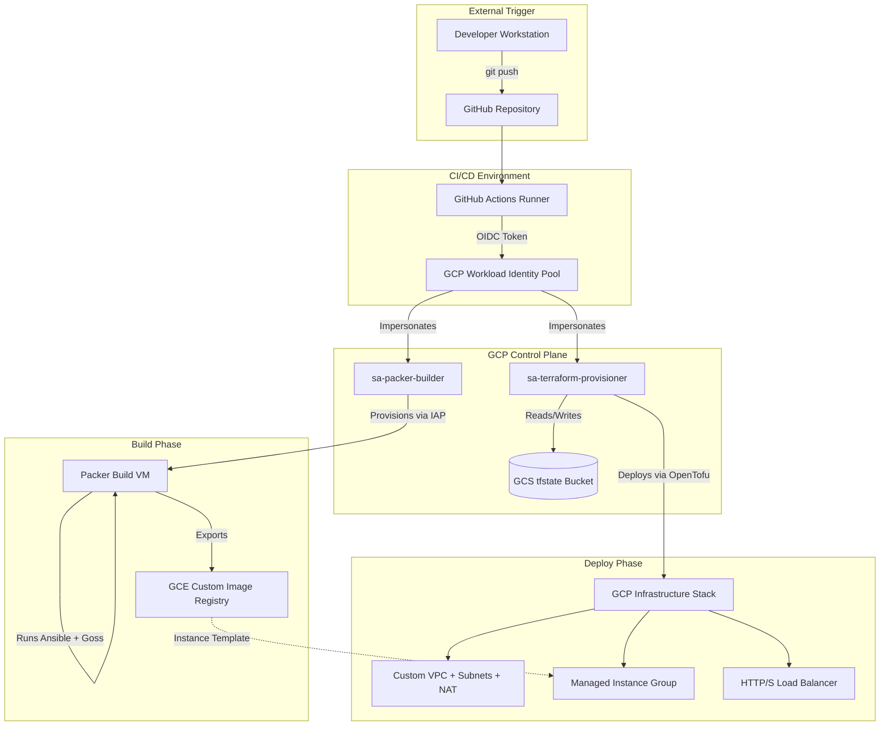

# Immutable Infrastructure Pipeline

## 1. Overview and Philosophy

Immutable infrastructure replaces in-place server patching with atomic artifact replacement. By baking the OS configuration into a static machine image prior to deployment, this architecture provides three core guarantees: it eliminates configuration drift across the fleet, enables atomic rollbacks by redeploying previously validated images, and ensures verified image provenance by treating running instances as read-only — configuration changes require a new image build, never a direct login to production.

For a portfolio reviewer, this pipeline demonstrates a production-grade delivery mechanism. It emphasizes infrastructure as code, least-privilege IAM design with Workload Identity Federation for keyless CI authentication, and a two-tier local testing strategy — Docker-based Ansible iteration for sub-90-second feedback cycles and full GCP Packer builds for final integration validation — with automated Goss verification gates before any image is promoted to infrastructure.

---

## 2. Architecture



### Architecture Boundaries and Rationale

**Build Phase (Packer & IAP):** Packer acts as the orchestrator for image creation, spinning up an ephemeral Compute Engine instance. IAP tunneling was chosen over a bastion host because it eliminates a permanently running network ingress point — there is no jump server to patch, monitor, or secure. The build VM has no public IP and is unreachable from the internet; GCP's IAP service brokers the SSH connection after verifying the caller's IAM identity. After applying the Ansible playbook and passing Goss validation, Packer halts the VM and exports the sealed machine image.

**Artifact Handoff:** The CI pipeline parses the output manifest from the Packer run to extract the specific Google Cloud image ID, guaranteeing that Terraform deploys the exact artifact that was just tested.

**Deploy Phase (OpenTofu/Terraform):** Terraform provisions the full infrastructure stack, including the custom VPC, subnets, and load balancer. The compute workload is deployed as a regional Managed Instance Group (MIG) distributed across `us-central1-a` and `us-central1-b`, ensuring that a single zone failure does not take the service offline. The MIG's auto-healing policy automatically replaces unhealthy instances using the GCP health check, removing the need for manual intervention during instance failures.

**State Management (GCS):** Terraform state is stored in GCS with object versioning enabled rather than locally, for two reasons: it enables concurrent pipeline runs to lock state safely, and versioning provides a recovery path if state becomes corrupted. Local state would make the pipeline non-reproducible across machines and incompatible with CI execution.

**IAM Boundary (Two Service Accounts):** The build and deploy phases use separate service accounts deliberately. `sa-packer-builder` has permissions to create and destroy VM instances but cannot modify network topology or update running infrastructure. `sa-terraform-provisioner` can manage infrastructure but has no permission to create images. A compromise of either account cannot affect the other's domain — the blast radius is bounded by design.

---

## 3. Security Model

This pipeline adheres to the principle of least privilege, segregating duties across three distinct service accounts.

| Service Account | Scope | Roles Granted | Reason |
|---|---|---|---|
| `sa-packer-builder` | Image Build | `roles/compute.instanceAdmin.v1`<br>`roles/compute.storageAdmin`<br>`roles/iam.serviceAccountUser`<br>`roles/iap.tunnelResourceAccessor` | Required to create ephemeral VMs, write the final image to the GCP registry, attach the compute service account to the build VM, and securely connect via Identity-Aware Proxy without a public IP. |
| `sa-terraform-provisioner` | Infrastructure Deployment | `roles/compute.instanceAdmin.v1`<br>`roles/compute.networkAdmin`<br>`roles/compute.loadBalancerAdmin`<br>`roles/compute.storageAdmin`<br>`roles/compute.securityAdmin`<br>`roles/iam.serviceAccountUser` | Read image artifacts from the Compute Engine image registry, deploy VPCs and firewall rules, provision load balancers and instance groups, and attach the runtime service account to final instances. GCS state backend access is granted separately via a bucket-level IAM binding. |
| `sa-compute-instance` | Application Runtime | `roles/logging.logWriter`<br>`roles/monitoring.metricWriter` | Bound to the final deployed instances. Strictly limited to exporting logs and telemetry back to the GCP operations suite. |

### Trust Chain

Authentication between GitHub Actions and GCP relies entirely on Workload Identity Federation (WIF). GitHub provides a short-lived OIDC token verifying the repository origin, which GCP validates against a configured Identity Pool to grant temporary impersonation rights to the respective service accounts, eliminating the need for stored static credentials in CI. An attribute condition on the provider restricts impersonation to workflows originating from the `tylermac92/immutable-pipeline` repository specifically — tokens from other repositories are rejected at the validation step.

---

## 4. Local Development

Testing immutable infrastructure can be slow if every configuration change requires a 20-minute GCP image bake. This repository implements a two-tier testing strategy to maintain developer velocity.

### Prerequisites

| Tool | Version |
|---|---|
| Google Cloud SDK | 571.0.0+ |
| Packer | 1.15.4 |
| OpenTofu | 1.12.1 |
| ansible-core | 2.17.9 |
| Docker | any recent version |

### Setup

```bash
# Clone the repository
git clone https://github.com/tylermac92/immutable-pipeline.git
cd immutable-pipeline

# Create Python virtual environment
python3 -m venv .venv
source .venv/bin/activate
pip install -r requirements.txt
ansible-galaxy collection install -r ansible/requirements.yml

# Configure environment variables
source .envrc
```

### Two-Tier Testing Strategy

**Tier 1 — Fast Iteration (Docker + Ansible, ~90 seconds):**

Developers run `test-ansible-local.sh` to execute the Ansible playbook against a local Docker container running Ubuntu 24.04. This validates syntax, file transfers, package installations, and configuration file content without incurring GCP compute costs.

```bash
./scripts/test-ansible-local.sh
./scripts/test-goss-local.sh
```

To support this, all systemd-dependent tasks and handlers in the playbook are guarded with `when: ansible_service_mgr == 'systemd'`. This ensures the container run succeeds in an environment without an init system, while the full service configuration is applied during the GCP VM bake where systemd is present.

**Tier 2 — Integration Verification (Packer, ~20 minutes):**

Once the fast loop passes, run the full Packer build to verify GCP integration, IAP tunneling, Ansible provisioning, and Goss validation against an actual Compute Engine instance.

```bash
GOOGLE_IMPERSONATE_SERVICE_ACCOUNT=${PACKER_SA} \
packer build -var="project_id=${PROJECT_ID}" packer/
```

### Deploying Infrastructure Locally

```bash
cd terraform

IMAGE_NAME=$(python3 -c "
import json
with open('../packer/manifest.json') as f:
    m = json.load(f)
last_uuid = m['last_run_uuid']
build = next(b for b in m['builds'] if b['packer_run_uuid'] == last_uuid)
print(build['artifact_id'])
")

tofu apply \
  -var="project_id=${PROJECT_ID}" \
  -var="image_name=${IMAGE_NAME}" \
  -var="sa_instance_runtime_email=sa-compute-instance@${PROJECT_ID}.iam.gserviceaccount.com"
```

---

## 5. Pipeline Reference

The GitHub Actions workflow triggers exclusively on path filters matching infrastructure source code, preventing unnecessary runs on documentation or unrelated changes.

**Trigger paths:** `packer/**`, `ansible/**`, `terraform/**`, `validation/**`

### Required Secrets

| Secret | Description |
|---|---|
| `GCP_PROJECT_ID` | Target GCP project identifier |
| `GCP_WORKLOAD_IDENTITY_PROVIDER` | Full resource path to the WIF provider |
| `GCP_PACKER_SA` | Full email address of the Packer build service account |
| `GCP_TERRAFORM_SA` | Full email address of the Terraform provisioning service account |

### Job Structure

**`build-image`:** Authenticates via WIF as `sa-packer-builder`, runs Packer, and exports the new GCE image ID as a GitHub Actions job output.

**`deploy-infrastructure`:** Requires `build-image` to pass. Authenticates via WIF as `sa-terraform-provisioner`, receives the exact GCE image ID via a GitHub Actions job output exported by `build-image`, and passes it explicitly to `tofu apply` as an input variable — no data source query against the live image family, eliminating the race condition between image baking and infrastructure deployment.

### GCP Project Setup

1. Create a GCP project and enable required APIs:

```bash
gcloud services enable \
  compute.googleapis.com \
  iam.googleapis.com \
  iamcredentials.googleapis.com \
  cloudresourcemanager.googleapis.com \
  oslogin.googleapis.com
```

2. Create service accounts:

```bash
for sa in sa-packer-builder sa-terraform-provisioner sa-compute-instance; do
  gcloud iam service-accounts create ${sa} --project=PROJECT_ID
done
```

3. Grant IAM roles to `sa-packer-builder`:

```bash
for role in \
  roles/compute.instanceAdmin.v1 \
  roles/compute.storageAdmin \
  roles/iam.serviceAccountUser \
  roles/iap.tunnelResourceAccessor; do
  gcloud projects add-iam-policy-binding PROJECT_ID \
    --member="serviceAccount:sa-packer-builder@PROJECT_ID.iam.gserviceaccount.com" \
    --role="${role}"
done
```

4. Grant IAM roles to `sa-terraform-provisioner`:

```bash
for role in \
  roles/compute.instanceAdmin.v1 \
  roles/compute.networkAdmin \
  roles/compute.loadBalancerAdmin \
  roles/compute.storageAdmin \
  roles/compute.securityAdmin \
  roles/iam.serviceAccountUser; do
  gcloud projects add-iam-policy-binding PROJECT_ID \
    --member="serviceAccount:sa-terraform-provisioner@PROJECT_ID.iam.gserviceaccount.com" \
    --role="${role}"
done
```

5. Grant IAM roles to `sa-compute-instance`:

```bash
for role in roles/logging.logWriter roles/monitoring.metricWriter; do
  gcloud projects add-iam-policy-binding PROJECT_ID \
    --member="serviceAccount:sa-compute-instance@PROJECT_ID.iam.gserviceaccount.com" \
    --role="${role}"
done
```

6. Create and configure the Terraform state bucket:

```bash
gsutil mb -p PROJECT_ID -l us-central1 -b on gs://PROJECT_ID-tfstate
gsutil versioning set on gs://PROJECT_ID-tfstate
gsutil iam ch \
  serviceAccount:sa-terraform-provisioner@PROJECT_ID.iam.gserviceaccount.com:roles/storage.admin \
  gs://PROJECT_ID-tfstate
```

7. Configure Workload Identity Federation:

```bash
# Create pool
gcloud iam workload-identity-pools create "github-actions-pool" \
  --location="global" \
  --project=PROJECT_ID

# Create OIDC provider
gcloud iam workload-identity-pools providers create-oidc "github-provider" \
  --location="global" \
  --workload-identity-pool="github-actions-pool" \
  --issuer-uri="https://token.actions.githubusercontent.com" \
  --attribute-mapping="google.subject=assertion.sub,attribute.repository=assertion.repository" \
  --attribute-condition="assertion.repository=='YOUR_GITHUB_ORG/YOUR_REPO'" \
  --project=PROJECT_ID

# Bind service accounts to the pool
for sa in sa-packer-builder sa-terraform-provisioner; do
  gcloud iam service-accounts add-iam-policy-binding \
    ${sa}@PROJECT_ID.iam.gserviceaccount.com \
    --role="roles/iam.workloadIdentityUser" \
    --member="principalSet://iam.googleapis.com/projects/PROJECT_NUMBER/locations/global/workloadIdentityPools/github-actions-pool/attribute.repository/YOUR_GITHUB_ORG/YOUR_REPO" \
    --project=PROJECT_ID
done
```

---

## 6. Known Limitations

**Local Authentication:** Local Terraform authentication requires a service account key file due to a sandbox environment constraint where ADC impersonation does not correctly populate the `source_credentials.account` field required by OpenTofu's GCS backend. The key file is scoped to `sa-terraform-provisioner` only, stored outside the project directory at `~/.config/gcloud/`, and is gitignored. In CI, no key file exists — authentication uses Workload Identity Federation exclusively. In a non-sandbox environment with a properly configured gcloud installation, replace the key file with:

```bash
gcloud auth application-default login \
  --impersonate-service-account=${TERRAFORM_SA}
```

**Default Compute Service Account:** The default Google Compute Engine service account retains `roles/editor` by default in the project. This is a baseline GCP behavior and should be explicitly disabled in a production hardening pass.

**Goss Validation in Docker:** Goss validation runs comprehensively against the GCP build VM. However, service state checks (e.g., verifying a process is running via systemd) are skipped during local Docker testing due to the absence of an init system in the container environment. The `when: ansible_service_mgr == 'systemd'` guard ensures these tasks are skipped cleanly rather than failing.

**Goss Binary Downloaded at Runtime:** The Goss validation script downloads the binary directly from GitHub Releases during each Packer build. This creates a build-time dependency on GitHub availability and introduces supply chain risk — a compromised release could affect image validation. The production remediation is to host the verified Goss binary in a GCS bucket owned by the project and modify `goss-install.sh` to pull from there instead, removing the external dependency from the build critical path.
